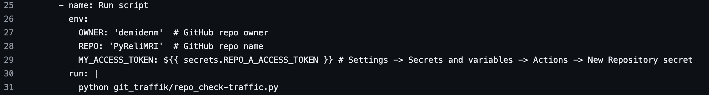
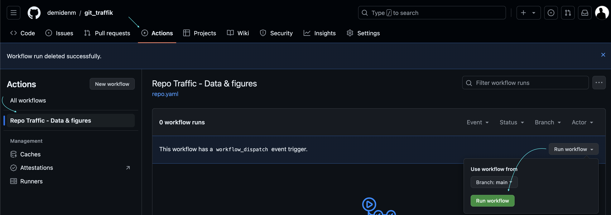
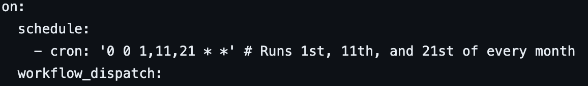
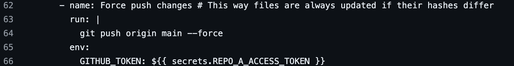
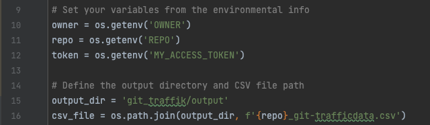
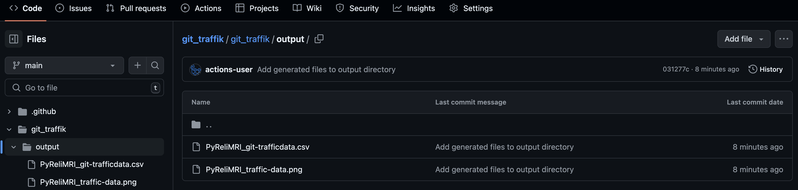
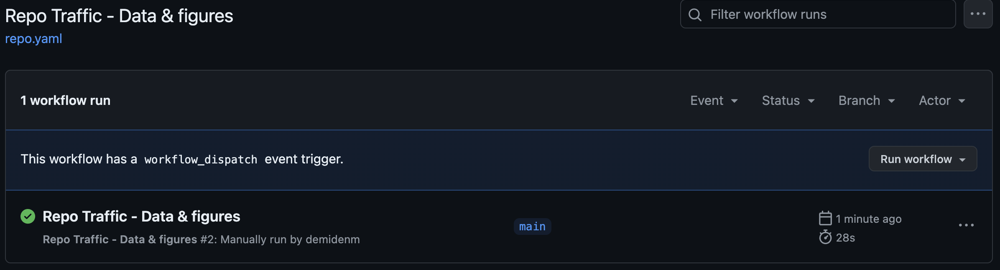

# git_traffik 📊

**Extract & Plot Git Repo Clones/Views Beyond 14-day Insights**

**Problem**: GitHub [Insights → Traffic data](https://docs.github.com/en/repositories/viewing-activity-and-data-for-your-repository/viewing-traffic-to-a-repository) only offers 14 days of visit/clone data.  
**Solution**: `git_traffik` automatically collects and stores your repository's traffic data every 10-14 days, building historical datasets beyond GitHub's limit.  
**Result**: Continuous historical data in CSV format + automated visualizations for any repository.

<div align="center">
  
</div>

## Setup

Choose your preferred method:

| Method | Use Case | 
|--------|----------|
| [**Standalone Repo**](#1-standalone-repository-recommended) | Track any repository | 
| [**Within Your Repo**](#2-integrate-within-your-repository) | Track the same repository | 
| [**Local Execution**](#3-run-locally) | Manual control & scheduling | 

---

## 1. Standalone Repository (Recommended)

**Best for**: Tracking any repository from a dedicated monitoring repo.

### Setup Steps:

1. **Get the code**: Fork this repository or clone it locally
2. **Configure repository details** in [`.github/workflows/repo.yaml`](.github/workflows/repo.yaml):

<div align="center">
  
</div>

3. **Create access token**: Generate a [personal access token](https://docs.github.com/en/authentication/keeping-your-account-and-data-secure/managing-your-personal-access-tokens#creating-a-fine-grained-personal-access-token) with repository permissions

4. **Add secret**: Go to Settings → Secrets & Variables → Actions, create `REPO_A_ACCESS_TOKEN` with your token

5. **Enable permissions**: Settings → Actions → General → Workflow Permissions → **"Read and write permissions"**

### Usage:
- **Manual trigger**: Run anytime from Actions tab
- **Automatic**: Runs on 1st, 11th, and 21st of each month
- **Customize schedule**: Modify the [cron schedule](https://www.quartz-scheduler.org/documentation/quartz-2.3.0/tutorials/crontrigger.html)

<div align="center">
  
</div>

<div align="center">
  
</div>

---

## 2. Integrate Within Your Repository

**Best for**: Tracking the same repository where the code lives.

### Setup Steps:

1. **Copy files** to your repository:
   - Copy `git_traffik/` folder to your repo root
   - Copy `.github/workflows/repo.yaml` to `.github/workflows/`

2. **Simplify authentication** - Update `repo.yaml`:
   ```yaml
   # Change this:
   MY_ACCESS_TOKEN: ${{ secrets.REPO_A_ACCESS_TOKEN }}
   # To this:
   MY_ACCESS_TOKEN: ${{ secrets.GITHUB_TOKEN }}
   ```

3. **Enable permissions**: Settings → Actions → General → Workflow Permissions → **"Read and write permissions"**

**Benefit**: No need to create personal access tokens! Uses GitHub's [automatic authentication](https://docs.github.com/en/actions/security-for-github-actions/security-guides/automatic-token-authentication).

<div align="center">
  
</div>

---

## 3. Run Locally

**Best for**: Manual control or custom scheduling on your machine.

### Setup Steps:

1. **Download script**: Get [`./git_traffik/repo_check_traffic.py`](./git_traffik/repo_check_traffic.py)

2. **Install dependencies**:
   ```bash
   pip install requests pandas matplotlib seaborn
   ```

3. **Configure script**: Update owner, repo, and token variables:

<div align="center">
  
</div>

4. **Run manually** or **set up cron job** using [crontab](https://phoenixnap.com/kb/cron-job-mac)

---

## What You Get

### Automated Data Collection
- **CSV files**: Complete historical traffic data
- 📊 **PNG visualizations**: Two-panel plots (views + clones over time)
- **Regular updates**: Scheduled collection every ~10 days

### Output Location
Results appear in `./git_traffik/output/`:
- `{REPO_NAME}_git-trafficdata.csv`
- `{REPO_NAME}_traffic-data.png`

<div align="center">
  
</div>

<div align="center">
  
</div>

---

## Technical Details

### Workflow Process
The [GitHub Actions workflow](.github/workflows/repo.yaml) automatically:

1. **Fetches** current 14-day traffic data via GitHub API
2. **Merges** with existing historical data (if any)
3. **Cleans** data: removes duplicates, filters zero-traffic days
4. **Generates** updated CSV and visualization files
5. **Commits** results back to repository
6. **Uploads** artifacts for easy download

### Dependencies
- `requests` - GitHub API communication  
- `pandas` - Data manipulation and CSV handling
- `matplotlib` & `seaborn` - Traffic visualization

### Schedule Configuration
Default: `'0 0 1,11,21 * *'` (1st, 11th, 21st of each month at midnight UTC)

Customize in `.github/workflows/repo.yaml` using [cron syntax](https://www.quartz-scheduler.org/documentation/quartz-2.3.0/tutorials/crontrigger.html).

---

## Real-World Example

I created this tool for my [PyReliMRI](https://github.com/demidenm/PyReliMRI) package to:
- **Track adoption**: Monitor if people are actually using the package
- **Inform decisions**: Determine if continued maintenance/expansion is worthwhile  
- **Prevent data loss**: Unfortunately, I lost 4-5 months of early data before implementing this!

The [current dataset](./git_traffik/output/PyReliMRI_git-trafficdata.csv) shows clear usage patterns that help guide development priorities.

---

## Troubleshooting

### Common Issues
- **"Workflow failed"** → Check token permissions (needs repository access)
- **"Permission denied"** → Enable "Read and write permissions" in Actions settings  
- **"No data collected"** → Verify repository name/owner in workflow file
- **"Schedule not working"** → Remember GitHub Actions use UTC time

### Quick Fixes
- **Manual trigger**: Use "Run workflow" button in Actions tab for testing
- **Check logs**: Click on failed workflow runs to see detailed error messages
- **Validate token**: Ensure your personal access token hasn't expired

---

## Contributing

Found this useful? Consider:
- **Starring** this repository
- **Reporting issues** you encounter  
- **Suggesting improvements** 

## License

MIT License - use freely for your projects!

---

**Stop losing your GitHub traffic data!** Set up git_traffik in under 5 minutes. 