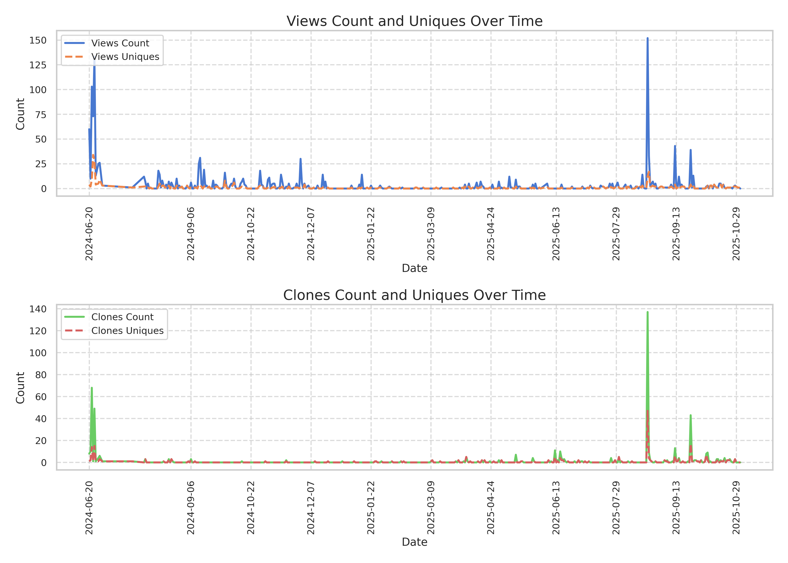

# git traffik

**Situation**: Github [Insights --> Traffic data](https://docs.github.com/en/repositories/viewing-activity-and-data-for-your-repository/viewing-traffic-to-a-repository) only offers 14-days of visit/clones data.
**Task**: Workflow is needed to access repository every 10-14days to pull the data and store it. Retains and expands visitor/clone history.
**Action**: `git_traffic` is a simple workflow that can be integrated directly within a repository, to separate repository to run on another repo, or run locally. 
**Result**: Historical data >14days in .csv and figure automatically for any repo.

## How Does it work

[.github/workflows/repo.yaml](.github/workflows/repo.yaml): 
Includes information for repository name [`REPO`], repo's owner [`OWNER`],
and the API key, [personal token](https://docs.github.com/en/authentication/keeping-your-account-and-data-secure/managing-your-personal-access-tokens#creating-a-fine-grained-personal-access-token), /
that provides access to read/write/pull/push to repository [`MY_ACCESS_TOKEN`]. Note, this token is stored as a [SECRET KEY](https://docs.github.com/en/actions/security-for-github-actions/security-guides/using-secrets-in-github-actions) for security.

To run, you either clone this repository and update the yaml, `.github/workflows/repo.yaml` with your information and 

## Basics of git_traffic repo

[.github/workflows/repo.yaml](.github/workflows/repo.yaml):

This YAML file defines a GitHub Actions workflow named "Repo Data & figures" that performs the following tasks:

Schedule/Trigger: It runs on the 1st, 11th, and 21st of every month at midnight (UTC) & can be triggered manually. It uses [cron syntax](https://www.quartz-scheduler.org/documentation/quartz-2.3.0/tutorials/crontrigger.html)

Job: update-data runs on a ubuntu and includes these steps:

- Checkout Code: Retrieves the repository code within `git_traffik`.
- Sets Up Python 3.9.
- Install Dependencies: in  [./git_traffik/repo_check_trafic.py](./git_traffik/repo_check_trafic.py) such as requests, pandas, matplotlib, seaborn).
- Runs Script to gather data and generate figures.
  - Fetches GitHub repository traffic data & creates visuals
    - **Setup: Configures owner, repo name and person access token based on [repo.yaml](.github/workflows/repo.yaml) file**.
    - Data Retrieval: fetches views and clones data from GitHub API. Converts data to DataFrames and merges clones/views data. Keeps only unique dates and does not include dates when both clones/views are 0. Ensures unique timestamps and fills missing values.
    - If output/.csv alread exists it updates that data, else creates a CSV file with the traffic data.
    - Generates plots for views and clones over time in a two-panel figure 
    - Saves the plots as .csv & PNG files.
- List Files to display the contents that were generated
- Upload Output Files from the output directory as artifacts (these are saved to each workflows .zip).
- Configures Git using a generic user name and email.
- Check Git Status for changes in repo (if hashes identical, no changes)
- Add Files to staging output directory for commit to [./output/](./output/)
- Commit Files w/ message, if any changes exist.

This workflow ensures that data and figures are updated regularly and consistently in the repository.

## Example using [PyReliMRI](https://github.com/demidenm/PyReliMRI) package 

Created a small package that I wanted to observe the fluctations in use. Helps me determine whether a) people are using it and b) \
I should consider maintaining and expanding it. Unfortunately, discovered very quickly that the first 4-5 months of data were lost. Needed something \
more consistent.

Essentials to update in [repo.yaml](.github/workflows/repo.yaml): These are called as variables into .py code to use with api.

- OWNER: update the github repository owner to your name or whoever has access that granted you repo privileges
- REPO: update the repository name, in my case it is PyReliMRI. 
- MY_ACCESS_TOKEN: This is the taken to access the data, it needs to be private. In repo_trafficplots repo, in Settings --> Secrets & Variables --> Actions I created a [New Repository Secret](https://docs.github.com/en/actions/security-for-github-actions/security-guides/using-secrets-in-github-actions) with my Personal Token. You can create one for yourself by following the [instructions](https://docs.github.com/en/authentication/keeping-your-account-and-data-secure/managing-your-personal-access-tokens#creating-a-fine-grained-personal-access-token)

Once this is setup, the Actions are setup via an event trigger (cron details). You can review all runs and the associated logs. When \
the figures are created, they are updated in [./git_traffik/output/](./git_traffik/output/). The figure below is compiled based on the [running data](./git_traffik/output/PyReliMRI_git-trafficdata.csv)

Note: 

1. For the code to work, the token should have repo privileges.
2. For code to run, the repo where actions are being performed (e.g. rep_trafficplots) in Settings --> Actions --> General --> Workflow Permissions: _Read and write permissions_